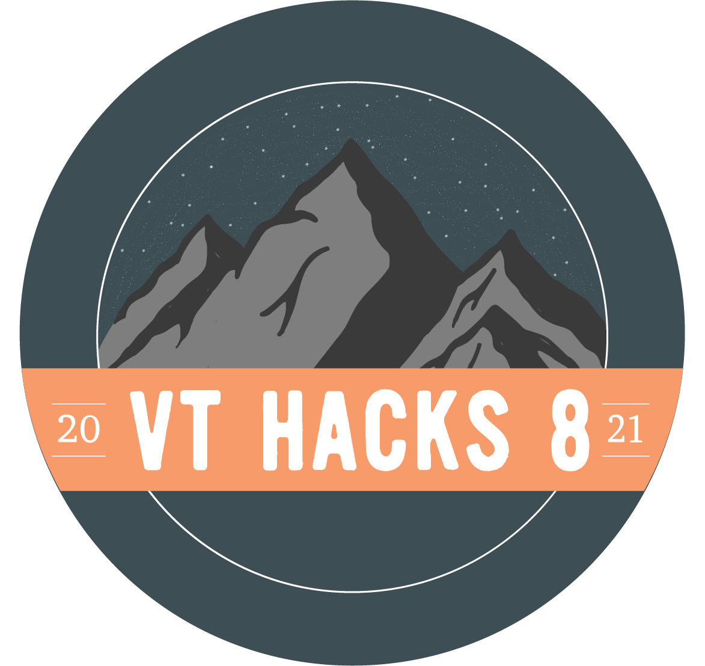

<p align="center">
  <a href="https://vthacks.com/" target="_blank" >
    
  </a>
</p>
<h1 align="center">
  VTHacks 2022 Website
</h1>

## Local Setup

``` bash
# install dependencies
npm i

# serve with hot reload at localhost:3000
npm run dev

# will correct anything prettier and eslint deem neccesary 
npm run lint:fix
```

For a detailed explanation on how things work, check out the [guide](http://vuejs-templates.github.io/webpack/) and [docs for vue-loader](http://vuejs.github.io/vue-loader).

## Build Status

[](https://app.netlify.com/sites/vt-hacks-www/deploys)
